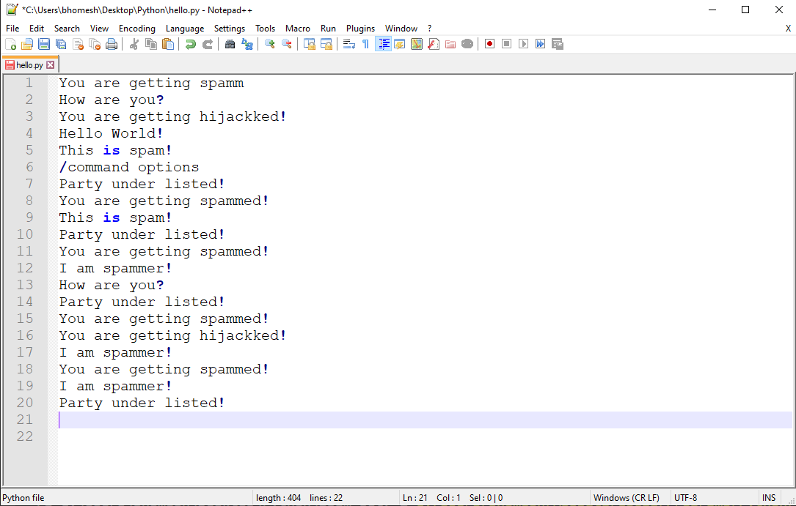

### Simple SPAM-BOT ###
An GUI to run spam commands! Using the pyautogui module.

### Requirements ###
Installing pyautogui --- pip install pyautogui

### Instructions ###
Simple run <<<spam.py>>> and open notepad++ to get into output.
    
## Output ##

